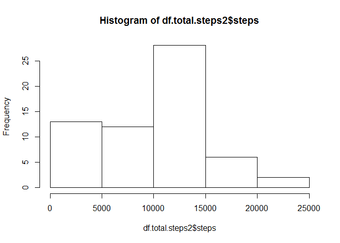

# Reproducible Research: Peer Assessment 1


## Loading and preprocessing the data

```r
df <- tbl_df(read.table(unz("activity.zip", "activity.csv"), header = T, quote="\"", sep = ",", na.strings = "NA", colClasses = "character"))
df <- df %>%
      mutate(steps = as.integer(steps)) %>%
      mutate(date = ymd(date)) %>%
      mutate(interval = str_pad(df$interval, 4, pad = "0"))
```


## What is mean total number of steps taken per day?

```r
## Histogram of total number of steps taken each day
df.complete.cases <- df[complete.cases(df),]
df.total.steps <- aggregate(steps ~ date, data = df.complete.cases, FUN = sum)
hist(df.total.steps$steps)
```

<!-- -->

```r
## Mean and Median total number of steps per day
print(summarize(group_by(df.complete.cases, date), Mean = mean(steps), Median = median(steps) ), n=53)
```

```
## # A tibble: 53 × 3
##          date       Mean Median
##        <date>      <dbl>  <dbl>
## 1  2012-10-02  0.4375000      0
## 2  2012-10-03 39.4166667      0
## 3  2012-10-04 42.0694444      0
## 4  2012-10-05 46.1597222      0
## 5  2012-10-06 53.5416667      0
## 6  2012-10-07 38.2465278      0
## 7  2012-10-09 44.4826389      0
## 8  2012-10-10 34.3750000      0
## 9  2012-10-11 35.7777778      0
## 10 2012-10-12 60.3541667      0
## 11 2012-10-13 43.1458333      0
## 12 2012-10-14 52.4236111      0
## 13 2012-10-15 35.2048611      0
## 14 2012-10-16 52.3750000      0
## 15 2012-10-17 46.7083333      0
## 16 2012-10-18 34.9166667      0
## 17 2012-10-19 41.0729167      0
## 18 2012-10-20 36.0937500      0
## 19 2012-10-21 30.6284722      0
## 20 2012-10-22 46.7361111      0
## 21 2012-10-23 30.9652778      0
## 22 2012-10-24 29.0104167      0
## 23 2012-10-25  8.6527778      0
## 24 2012-10-26 23.5347222      0
## 25 2012-10-27 35.1354167      0
## 26 2012-10-28 39.7847222      0
## 27 2012-10-29 17.4236111      0
## 28 2012-10-30 34.0937500      0
## 29 2012-10-31 53.5208333      0
## 30 2012-11-02 36.8055556      0
## 31 2012-11-03 36.7048611      0
## 32 2012-11-05 36.2465278      0
## 33 2012-11-06 28.9375000      0
## 34 2012-11-07 44.7326389      0
## 35 2012-11-08 11.1770833      0
## 36 2012-11-11 43.7777778      0
## 37 2012-11-12 37.3784722      0
## 38 2012-11-13 25.4722222      0
## 39 2012-11-15  0.1423611      0
## 40 2012-11-16 18.8923611      0
## 41 2012-11-17 49.7881944      0
## 42 2012-11-18 52.4652778      0
## 43 2012-11-19 30.6979167      0
## 44 2012-11-20 15.5277778      0
## 45 2012-11-21 44.3993056      0
## 46 2012-11-22 70.9270833      0
## 47 2012-11-23 73.5902778      0
## 48 2012-11-24 50.2708333      0
## 49 2012-11-25 41.0902778      0
## 50 2012-11-26 38.7569444      0
## 51 2012-11-27 47.3819444      0
## 52 2012-11-28 35.3576389      0
## 53 2012-11-29 24.4687500      0
```


## What is the average daily activity pattern?

```r
## Plot average steps taken per day interval
df.mean.by.interval <- summarize( group_by(df.complete.cases, interval), Mean = mean(steps) )
plot(df.mean.by.interval$interval, df.mean.by.interval$Mean, type = "l", xlab = "Interval", main = "Daily Activity Pattern", ylab = "Average number of steps" )
```

<!-- -->

```r
## Max number of steps per day interval
max(df.mean.by.interval$Mean)
```

```
## [1] 206.1698
```


## Imputing missing values

```r
## calculate and report the total number of missing values in the dataset
sum( complete.cases(df) == "FALSE" )
```

```
## [1] 2304
```

```r
## Devise a strategy for filling missing values
df.clean <- df %>%
  mutate( steps = ifelse( is.na(steps), 1, steps) )

df.total.steps2 <- aggregate(steps ~ date, data = df.clean, FUN = sum, na.rm = FALSE)
hist(df.total.steps2$steps)
```

<!-- -->

## Are there differences in activity patterns between weekdays and weekends?

```r
## Mean and Median total number of steps per day
print(summarize(group_by(df.clean, date), Mean = mean(steps), Median = median(steps) ), n=100)
```

```
## # A tibble: 61 × 3
##          date       Mean Median
##        <date>      <dbl>  <dbl>
## 1  2012-10-01  1.0000000      1
## 2  2012-10-02  0.4375000      0
## 3  2012-10-03 39.4166667      0
## 4  2012-10-04 42.0694444      0
## 5  2012-10-05 46.1597222      0
## 6  2012-10-06 53.5416667      0
## 7  2012-10-07 38.2465278      0
## 8  2012-10-08  1.0000000      1
## 9  2012-10-09 44.4826389      0
## 10 2012-10-10 34.3750000      0
## 11 2012-10-11 35.7777778      0
## 12 2012-10-12 60.3541667      0
## 13 2012-10-13 43.1458333      0
## 14 2012-10-14 52.4236111      0
## 15 2012-10-15 35.2048611      0
## 16 2012-10-16 52.3750000      0
## 17 2012-10-17 46.7083333      0
## 18 2012-10-18 34.9166667      0
## 19 2012-10-19 41.0729167      0
## 20 2012-10-20 36.0937500      0
## 21 2012-10-21 30.6284722      0
## 22 2012-10-22 46.7361111      0
## 23 2012-10-23 30.9652778      0
## 24 2012-10-24 29.0104167      0
## 25 2012-10-25  8.6527778      0
## 26 2012-10-26 23.5347222      0
## 27 2012-10-27 35.1354167      0
## 28 2012-10-28 39.7847222      0
## 29 2012-10-29 17.4236111      0
## 30 2012-10-30 34.0937500      0
## 31 2012-10-31 53.5208333      0
## 32 2012-11-01  1.0000000      1
## 33 2012-11-02 36.8055556      0
## 34 2012-11-03 36.7048611      0
## 35 2012-11-04  1.0000000      1
## 36 2012-11-05 36.2465278      0
## 37 2012-11-06 28.9375000      0
## 38 2012-11-07 44.7326389      0
## 39 2012-11-08 11.1770833      0
## 40 2012-11-09  1.0000000      1
## 41 2012-11-10  1.0000000      1
## 42 2012-11-11 43.7777778      0
## 43 2012-11-12 37.3784722      0
## 44 2012-11-13 25.4722222      0
## 45 2012-11-14  1.0000000      1
## 46 2012-11-15  0.1423611      0
## 47 2012-11-16 18.8923611      0
## 48 2012-11-17 49.7881944      0
## 49 2012-11-18 52.4652778      0
## 50 2012-11-19 30.6979167      0
## 51 2012-11-20 15.5277778      0
## 52 2012-11-21 44.3993056      0
## 53 2012-11-22 70.9270833      0
## 54 2012-11-23 73.5902778      0
## 55 2012-11-24 50.2708333      0
## 56 2012-11-25 41.0902778      0
## 57 2012-11-26 38.7569444      0
## 58 2012-11-27 47.3819444      0
## 59 2012-11-28 35.3576389      0
## 60 2012-11-29 24.4687500      0
## 61 2012-11-30  1.0000000      1
```

```r
## Create a new factor variable in the data set
df.clean$weekdays<-weekdays(df.clean$date)
df.clean$factor<- as.factor(c("weekend", "weekday"))
df.clean[df.clean$weekdays == "Sunday" | df.clean$weekdays == "Saturday" ,5]<- factor("weekend")
df.clean[!(df.clean$weekdays == "Sunday" | df.clean$weekdays == "Saturday"),5 ]<- factor("weekday")

## Create a panel plot containing a time series
df.clean.weekday <- subset(df.clean, factor == "weekday")
df.clean.weekend <- subset(df.clean, factor == "weekend")
steps.mean.weekday <- tapply(df.clean.weekday$steps, df.clean.weekday$interval, mean)
steps.mean.weekend <- tapply(df.clean.weekend$steps, df.clean.weekend$interval, mean)
par(mfrow=c(2,1), mar = c(5, 4, 1, 1))
plot(y = steps.mean.weekday, x = names(steps.mean.weekday), type = "l", xlab = "Interval", main = "Weekday Activity Pattern", ylab = "Average number of steps", ylim=c(0,220))
plot(y = steps.mean.weekend, x = names(steps.mean.weekend), type = "l", xlab = "Interval", main = "Weekend Activity Pattern", ylab = "Average number of steps", ylim = c(0,220))
```

<!-- -->

